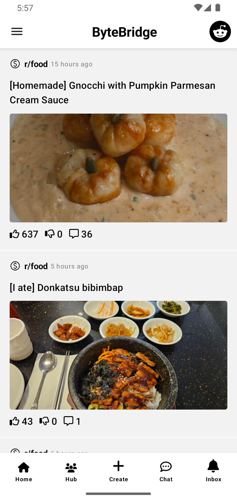

# ByteBridge

ByteBridge is an replicated version of reddit.

This Reddit Api as:
* r/Sports
* r/Technology
* r/Food

  
  
  
  
  
  

ByteBridge is still under development in testing as well as some pages.

Libraries:
* Compose Toolkit
* Hilt
* Dependency Injection
* Kotlin Coroutines
* Firebase Authentication 

Copyright 2023 Praveen Krishnamoorthy

